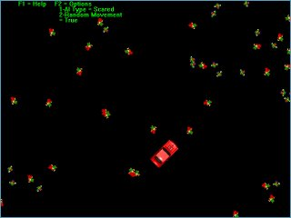



## Hit'n Run\!

### Description

This was written a long time ago and I can see a lot of it is poorly written and set out and is totally uncommented, but if you can't understand something email me and ask:). Hit'n run is a full screen car game where there are pedestrians walking around and u get to run them over, it has no goal but it's a fun little game. There are some shortcuts I took like I used circular collision, which is fine for the pedestrians but for the car it means the pedestrians have to hit a circle that has a diameter of the width of the car. If you stay still and make AI "Suicidal" then move after a couple of dead pedestrians, their bodies will be in a circle not a rectangle like the car. Also the car has only one speed and a poor turning circle, the wide turning circle makes it a bit harder to hit the pedestrians, and makes it harder for anyone to notice the circular collision. The pedestrians AI is "None", "Suicidal" or "Scared", they speak for them selves. There is one extra option that effects the AI options above, that is random. If random is turned on it will effect the AI by turning the person randomly within 90 degrees of the direction set by the AI. I stole the picture of the car of GTA if you haven't already noticed.
 
### More Info
 

             |
---                |---
**Submitted On**   |2004-01-16 23:31:34
**By**             |[Andrew Green](https://github.com/Planet-Source-Code/PSCIndex/blob/master/ByAuthor/andrew-green.md)
**Level**          |Intermediate
**User Rating**    |3.0 (6 globes from 2 users)
**Compatibility**  |VB 6\.0
**Category**       |[Games](https://github.com/Planet-Source-Code/PSCIndex/blob/master/ByCategory/games__1-38.md)
**World**          |[Visual Basic](https://github.com/Planet-Source-Code/PSCIndex/blob/master/ByWorld/visual-basic.md)
**Archive File**   |[Hit'n\_Run\!18087810212004\.zip](https://github.com/Planet-Source-Code/andrew-green-hit-n-run__1-56866/archive/master.zip)

